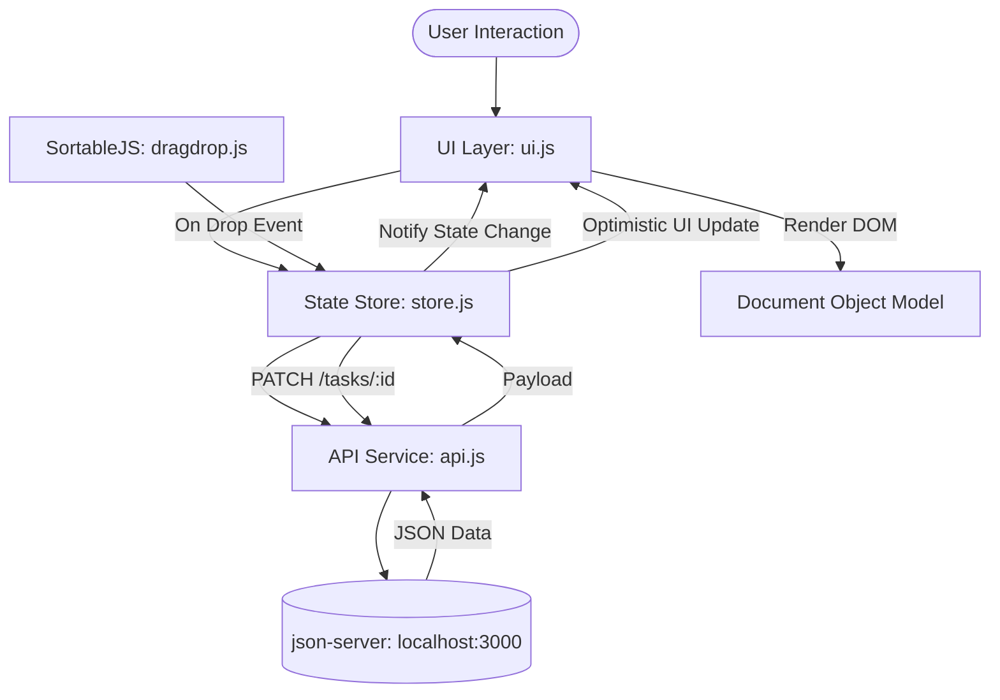

# 02 - System Architecture & Frontend Design

## Overview
The application follows a modular, client-side architecture written in Vanilla JavaScript (ES6 Modules) connected via asynchronous HTTP requests to a local `json-server` instance. The architecture prioritizes separation of concerns, single responsibility per module, predictable state flow, and native web platform features.

## High-Level Architecture

## Module Boundaries & Responsibilities

### 1. Entry Point (`src/js/index.js`)
- Initializes application lifecycle upon `DOMContentLoaded`.
- Orchestrates setup of the state store, UI event listeners, drag-and-drop instances, and initial data fetch.
- Sets up theme preference detection and toggle handling.

### 2. API Service Layer (`src/js/api.js`)
- Encapsulates all `fetch()` HTTP network operations against `http://localhost:3000`.
- Implements methods:
  - `fetchTasks()` -> `GET /tasks`
  - `createTask(taskData)` -> `POST /tasks`
  - `updateTask(taskId, updates)` -> `PATCH /tasks/${taskId}`
  - `deleteTask(taskId)` -> `DELETE /tasks/${taskId}`
  - `fetchComments(taskId)` -> `GET /comments?taskId=${taskId}`
  - `createComment(commentData)` -> `POST /comments`
- Handles HTTP error status codes, network timeouts, and JSON serialization.

### 3. Central State Store (`src/js/store.js`)
- Single source of truth for runtime data:
  - `tasks`: Array of active task objects.
  - `activeFilter`: Current search text, priority filter, and status filter.
  - `activeTaskId`: Identifier of the task currently open in the detail modal.
  - `activeComments`: Array of comments associated with the active task.
  - `metrics`: Computed task counts per column.
- Dispatches custom events / callbacks whenever state mutates to trigger focused UI re-renders.

### 4. UI Layer (`src/js/ui.js`)
- Manages DOM queries, template rendering, and event delegation.
- Renders:
  - Column card lists (`todo`, `doing`, `done`).
  - Header statistics counters.
  - Priority badges, overdue indicators, and formatted dates.
  - Toast notifications for success and error messages.
- Controls HTML5 `<dialog>` opening (`showModal()`), closing (`close()`), and form resets.

### 5. Drag & Drop Module (`src/js/dragdrop.js`)
- Initializes `SortableJS` on each column container (`.kanban-cards-list`), supporting both static and dynamically created columns.
- Handles `onEnd` events when a card is dropped:
  - Extracts card ID and target column status.
  - Applies optimistic UI update and metrics recalculation.
  - Invokes `store.moveTask(taskId, newStatus)`.
  - Reverts card DOM position and shows an error toast if `PATCH` fails.
  - Configures mobile touch delay (150ms) to ensure smooth touch scrolling without accidental drags.

### 6. Modal & Dialog Controller (`src/js/modal.js`)
- Controls native HTML5 `<dialog>` elements across the entire lifecycle:
  - **Task Creation Modal (`#create-task-dialog`)**: Manages form field validation, priority selection, tag previews, and team member assignment dropdown.
  - **Task Detail & Inspection Modal (`#task-detail-dialog`)**: Real-time inline editing for title and description, subtask checklist items with progress percentage, and chronological comments feed with deletion.
  - **Team Member Management Modal (`#user-management-dialog`)**: User registration (`POST /users`) with automatic DiceBear Bottts Neutral avatar generation and interactive roster view.
  - **Confirmation Dialogs**: Accessible prompt for irreversible card or column deletion.

### 7. Utilities (`src/js/utils.js`)
- Sanitization functions to prevent XSS (`escapeHtml`).
- Date formatters (formatting ISO dates to localized Spanish readable format and calculating overdue status).
- Debounce helper for non-blocking live search input.
- Hashtag extraction (`extractHashtags`) and deterministic color token assignment (`getTagColorClass`).
- Toast notification alerts (`showToast`).

---

## Modal Lifecycle with Native `<dialog>`
The project leverages the native HTML5 `<dialog>` element:
- **Task Creation Modal (`#create-task-dialog`)**: Opened via "New Task" buttons. Closed on submission or cancel. Native `::backdrop` provides background blur and dimming.
- **Task Detail & Comments Modal (`#task-detail-dialog`)**: Opened on card click. Houses editable title and description fields, metadata display, subtasks checklist, existing comments feed, and a new comment form.
- **Team Management Modal (`#user-management-dialog`)**: Registered users roster, new member creation form, and Bottts Neutral robot avatars.
- **Keyboard Handling**: Pressing `Escape` automatically dismisses active dialogs. Focus is trapped natively inside the modal while open and restored to triggering element upon close.

---

## Responsive & Viewport Architecture (100% Fluid)
- **Full Viewport Utilization**: The layout expands fluidly across 1080p, 1440p, 4K, and ultrawide screens, utilizing `width: 100%` and `height: 100vh / 100dvh`.
- **Independent Column Scrolling**: Board columns stretch vertically while cards scroll independently inside `.kanban-cards-list`, maintaining persistent headers and toolbars.
- **Mobile Horizontal Snap Scrolling (<768px)**: Columns use `scroll-snap-type: x mandatory` with smooth horizontal swiping across 86vw-wide columns and stacked compact modal controls.

