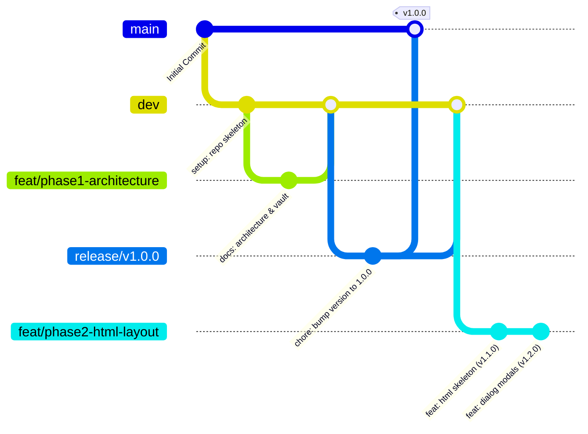

# 06 - GitFlow Strategy & Semantic Versioning Policy

## Overview
To guarantee professional software lifecycle management and clean team collaboration, the **Tablero Kanban** project adheres strictly to **GitFlow** branching and a customized **Semantic Versioning (SemVer)** protocol mapped to milestone phases and tasks.

---

## Branching Architecture



### Branch Responsibilities
| Branch | Origin | Target | Purpose | Tagged? |
| :--- | :--- | :--- | :--- | :--- |
| **`main`** | Root | Production | Production releases only. Must always be stable and deployable. | Yes (`vX.0.0` or `vX.Y.Z`) |
| **`dev`** | `main` | `main` | Continuous development and integration branch. | No |
| **`feat/<issue-or-task-slug>`** | `dev` | `dev` | Dedicated feature branch for individual tasks or sub-phases. | No |
| **`release/vX.0.0`** | `dev` | `main` & `dev` | Prepares major milestone releases upon phase completion. | Yes (on merge to `main`) |
| **`hotfix/vX.Y.Z`** | `main` | `main` & `dev` | Urgent bug fixes directly on production code. | Yes (on merge to `main`) |

---

## Semantic Versioning (SemVer) Conventions

Version strings follow the standard `MAJOR.MINOR.PATCH` format with strict project-level semantics:

### 1. Major Version (`X.0.0`) — Phase Milestone
- Incremented whenever a complete **Milestone Phase** is completed and released to `main`.
- **Phase 1** (Architecture & Setup) ➔ `v1.0.0`
- **Phase 2** (Semantic HTML Layout) ➔ `v2.0.0`
- **Phase 3** (CSS Design System) ➔ `v3.0.0`
- **Phase 4** (API & Data Layer) ➔ `v4.0.0`
- **Phase 5** (State Store & CRUD) ➔ `v5.0.0`
- **Phase 6** (SortableJS Drag & Drop) ➔ `v6.0.0`
- **Phase 7** (Modal & Comments) ➔ `v7.0.0`
- **Phase 8** (Search, Filters & Tests) ➔ `v8.0.0`
- **Phase 9** (Launcher & GitHub Pages) ➔ `v8.1.0`
- **Phase 10** (Advanced Bonus Features) ➔ `v9.0.0`
- **Phase 11** (Full-Screen Responsive Layout) ➔ `v10.0.0`
- **Hotfix 12** (Mobile Toolbar & Avatars) ➔ `v10.0.1`

### 2. Minor Version (`X.Y.0`) — Task Completion
- Incremented on **every individual task** completed within the current phase.
- Updated in `package.json` with every task commit.
- Example during Phase 2 (Target: `2.0.0`):
  - Task 1 (Header & Metrics HTML): `v1.1.0`
  - Task 2 (Columns HTML Structure): `v1.2.0`
  - Task 3 (Dialog Modals HTML): `v1.3.0`
  - Phase 2 Release Merge: `v2.0.0`

### 3. Patch Version (`X.Y.Z` / `0.0.X`) — Bugfixes & Hotfixes
- Incremented strictly for bugfixes, typos, or emergency hotfixes applied to production or active branches.

---

## Commit Cadence & Format
- **Rule**: Exactly **one commit per task**. No bundled multi-task commits.
- **Language**: English only.
- **Format**: Conventional Commits:
  - `feat(<scope>): <description> (refs #<issue-id>)`
  - `fix(<scope>): <description> (refs #<issue-id>)`
  - `docs(<scope>): <description> (refs #<issue-id>)`
  - `style(<scope>): <description> (refs #<issue-id>)`
  - `refactor(<scope>): <description> (refs #<issue-id>)`
  - `test(<scope>): <description> (refs #<issue-id>)`
  - `chore(<scope>): <description> (refs #<issue-id>)`

### Commit Message Examples
```bash
docs(vault): establish system architecture and design tokens (refs #1)
feat(html): implement semantic header and metrics dashboard (refs #2)
feat(modal): add native dialog element for task creation (refs #2)
chore(release): release phase 2 v2.0.0 (refs #2)
```
